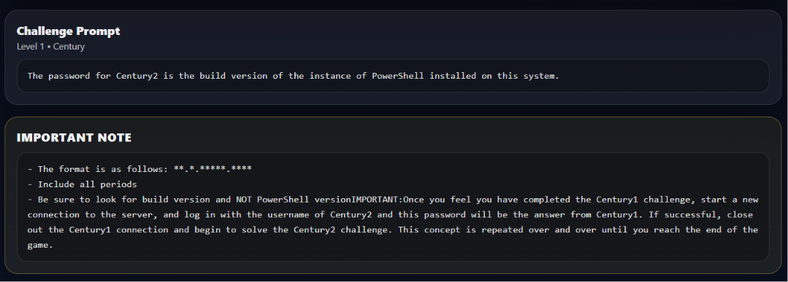

# UnderTheWire

https://learn.microsoft.com/en-us/powershell/module/microsoft.powershell.core/get-command?view=powershell-7.6 (I learn all the get command in here!)

## Century

- Century 1
    
    ```bash
    ssh century1@century.underthewire.tech
    ```
    
    
    
    `Credential: century1:century1`
    
    
    
    > The challenge said , the century 2 password is the build version of the instance of Powershell installed
    > 
    
    *So I searched on the internet what is a build version , and I found this command and explaination;
    
    
    
    
    
    Found the build version, its : `10.0.14393.9140`
    
- Century 2
    
    ```bash
    ssh century2@century.underthewire.tech
    ```
    
    Use the creds that we got from previous chall → century2:`10.0.14393.9140`
    
    
    
    > We need to find the Century3 password, which the challenge said the name of the built-in cmdlet that performs the wget like function..
    > 
    
    
    
    
    
    Found this on the internet for the explaination of wget and invoke-webrequest
    
    so the first half of the password is `invoke-webrequest` , need to find the second half password , and the clue the challenge says is “`PLUS the name of the file on the desktop.`”
    
    
    
    - I use `ls`  to search for the name of the file and found `443`
    - So the creds for `century3 : invoke-webrequest443`
- Century 3
    
    ```bash
    ssh century3@century.underthewire.tech
    ```
    
    
    
    - Log in to the ssh century3 using credential `century3 : invoke-webrequest443`
    - The chall says the pass for century 4 is the number of files in the desktop
    
    
    
    
    
    - The cred for `century4:123`
- Century 4
    
    ```bash
    ssh century4@century.underthewire.tech
    ```
    
    
    
    
    
    the cred for `century5:15768`
    
- Century 5
    
    ```bash
    ssh century5@century.underthewire.tech
    ```
    
    
    
    - I searched on the internet and read about `Get-ADDomain` command
    
    
    
    - Tried it on my powershell
    
    
    
    - Assumed that this name `underthewire` is the first half of the credential for century 6 , the second half clue is, the name of the file in the desktop. So , I use `ls` and found `3347`
    
    
    
    Combine both answer , the cred for `century6:underthewire3347`
    
- Century 6
    
    ```bash
    ssh century6@century.underthewire.tech
    ```
    
    
    
    
    
    - Too many to count, so i use `(Get-ChildItem -Directory).Count`  Since we are counting on folder specifically at the desktop folder only
    
    
    
    
    
    The cred for `century 7: 197` 
    
- Century 7
    
    ```bash
    ssh century7@century.underthewire.tech
    ```
    
    - Loggin using the previous credential that we got from century 6 `century 7: 197`
    
    
    
    
    
    Found the readme.txt file in \Downloads
    
    So the password for `century 8 : 7points`
    
- Century 8
    
    ```bash
    ssh century8@century.underthewire.tech
    ```
    
    - Loggin with the credential that we got previously `century 8 : 7points`
    
    
    
    - After I `ls` I found the `unique.txt`
    
    
    
    `Get-Help unique`
    
    
    
    Use **`get-help sort -detail` and found this `-Unique`  parameter**
    
    
    
    - Found the number of unique entries
    
    
    
    So the credential for `century 9: 696`
    
- Century 9
    
    ```bash
    ssh century9@century.underthewire.tech
    ```
    
    
    
    
    
    
    
    
    
    After i use the `-Delimeter` 
    
    
    
    
    
    
    
    
    
    - The password for `century 10: pierid`
- Century 10
    
    ```bash
    ssh century10@century.underthewire.tech
    ```
    
    
    
    ```bash
    PS C:\users\century10\desktop> get-service -Name "Windows Update" | Select-Object *
    
    Name                : wuauserv
    RequiredServices    : {rpcss}
    CanPauseAndContinue : False
    CanShutdown         : False
    CanStop             : False
    DisplayName         : Windows Update
    DependentServices   : {}
    MachineName         : .
    ServiceName         : wuauserv
    ServicesDependedOn  : {rpcss}
    ServiceHandle       :
    Status              : Stopped
    ServiceType         : Win32ShareProcess
    StartType           : Manual
    Site                :
    Container           :
    ```
    
    `get-WMIObject -Class Win32_Service -Filter "Name='wuauserv'" | Select-Object *`
    
    
    
    - The first half is `windowsupdates`  since the 10th word is = windows , and 8th word is = updates
    
    
    
    - The second half is `110`
    - The password for century 11 is `windowsupdates110`
- Century 11
    
    ```bash
    ssh century11@century.underthewire.tech
    ```
    
    - Loggin with the century11: `windowsupdates110`
    
    
    
    
    
    
    
    
    
    
    
    - Th ecreds for `century12:secret_sauce`
- Century 12
    
    ```bash
    ssh century12@century.underthewire.tech
    ```
    
    Login using `century12:secret_sauce` 
    
    
    
    
    
    
    
    
    
    - we got the first half of the pass
    
    
    
    - the second half of the password
    
    The password for `century13: i_authenticate_things` 
    
- Century 13
    
    ```bash
    ssh century13@century.underthewire.tech
    ```
    
    - Login using `century13: i_authenticate_things`
    
    
    
    
    
    
    
    The password is `century14: 755` 
    
- Century 14
    
    ```bash
    ssh century14@century.underthewire.tech
    ```
    
    Loggin using the `century14: 755` credential
    
    
    
    
    
    The password is `century15:153`
    
- Century 15
    
    
    
    Done!
    

## Cyborg

- Cyborg1
    
    ```bash
    ssh cyborg1@cyborg.underthewire.tech
    ```
    
    Login using this credential `cyborg1:cyborg1`
    
    
    
    Tryin to find the command using `Get-Command *` I found the `Get-ADUser`
    
    
    
    Tried findin `Chris Rogers` using `Get-ADUser`
    
    
    
    Could not find the `st` field name , so I tried to find in properties and found `st: kansas` 
    
    
    
    so the credential for cyborg 2 is `cyborg2: kansas` 
    
- Cyborg2
    
    ```bash
    ssh cyborg2@cyborg.underthewire.tech
    ```
    
    
    
    
    
    - Found the name for second half
    
    
    
    
    
    - Found the IPaddr by using Resolve-DnsName command
    - so the password must be `172.31.45.167_ipv4`
    - Note for self
        - DNS stands for **Domain Name System**. Often called the "phonebook of the Internet," it translates easy-to-read domain names (like `google.com`) into machine-readable IP addresses (like `142.250.190.14`), allowing your browser to load
- Cyborg 3
    
    ```bash
    ssh cyborg3@cyborg.underthewire.tech
    ```
    
    login by using cyborg3 : `172.31.45.167_ipv4` 
    
    
    
    
    
    -After `ls`  there’s file name `_objects` and tryin to find the number of user in the Cyborg group within AD, so I found useful command which is `Get-ADGroupMember` 
    
    
    
    
    
    
    
    - so the full password for cyborg 4 is `88_objects`
- Cyborg 4
    
    ```bash
    ssh cyborg4@cyborg.underthewire.tech
    ```
    
    Login by using the password `88_objects`
    
    
    
    - Name of the file in desktop is
    
    
    
    - To list information about available PowerShell modules there is the **Get-Module** cmdlet:
    
    
    
    
    
    - the password for `Cyborg 5: bacon_eggs`
- Cyborg 5
    
    ```bash
    ssh cyborg5@cyborg.underthewire.tech
    ```
    
    
    
    - the name of the file on the desktop
    
    
    
    - For the logon hours there is the [Logon-Hours](https://msdn.microsoft.com/en-us/library/ms676846(v=vs.85).aspx) Active Directory attribute. Its display name is **logonHours**, which we’ll use for filtering:
    
    
    
    - The last name is `Rowray`
    - The password for `cyborg6 is rowray_timer`
- Cyborg 6
    
    ```bash
    ssh cyborg6@cyborg.underthewire.tech
    ```
    
    - Loggin using the password `rowray_timer`
    
    
    
    - I check the file content
    
    
    
    - Need to decode this base64
    
    
    
    
    
    -The password for cyborg 7 is `cybergeddon`
    
- Cyborg 7 *
    
    ```bash
    ssh cyborg7@cyborg.underthewire.tech
    ```
    
    - Login using `cybergeddon`
    
    
    
    
    
- Cyborg 8
    
    ```bash
    ssh cyborg8@cyborg.underthewire.tech
    ```
    
    Password: `skynet` 
    
    
    
    - Zone information is recorded in the **Zone.Identifier** data stream. We can easily view all [Alternate Data Streams](https://blogs.technet.microsoft.com/askcore/2013/03/24/alternate-data-streams-in-ntfs/) for a file using PowerShell:
    
    
    
    - The password for cybor9 is `4`
- Cyborg 9
    
    ```bash
    ssh cyborg9@cyborg.underthewire.tech
    ```
    
    - Login using the password `4`
    
    
    
    
    
    The password for cyborg 10 is `onita99` 
    
- Cyborg 10
    
    ```bash
    ssh cyborg10@cyborg.underthewire.tech
    ```
    
    - Login using `onita99`
    
    
    
    
    
    - The password is `terminated!99`
- Cyborg 11
    
    ```bash
    ssh cyborg11@cyborg.underthewire.tech
    ```
    
    - Login using `terminated!99`
    
    
    
    - First we need to know the location of IIS logs. In this case is one of the default locations - *c:\inetpub\logs\LogFiles*. We could solve this quickly using [findstr](https://docs.microsoft.com/en-us/windows-server/administration/windows-commands/findstr) with the **/V** flag, but it’s more interesting to do it in PowerShell using **Select-String** and a regular expressions pattern:
    
    
    
    - The password for cyborg 12 is `spaceballs`
- Cyborg 12
    
    ```bash
    ssh cyborg12@cyborg.underthewire.tech
    ```
    
    
    
    - The best way I found to get extended details about a service is the **Get-WmiObject** cmdlet with a filter for *Win32_Service* classes:
    
    
    
    
    
    - the second half of the password is the name file
    
    
    
    - The password for cyborg 13 is `ywa6_heart`
- Cyborg 13
    
    ```bash
    ssh cyborg13@cyborg.underthewire.tech
    ```
    
    
    
    - The file on the Desktop:
    
    
    
    - And for the refresh interval we have the convenient **DNSServerZoneAging** command
    
    
    
    - The password for cyborg 14 is `22_days`
- Cyborg 14
    
    ```bash
    ssh cyborg14@cyborg.underthewire.tech
    ```
    
    
    
    - To get information about DCOM applications we can use again the **Get-WmiObject** cmdlet and filter for *Win32_DCOMApplication* classes:
    
    
    
    - The file name in the desktop is
    
    
    
    - The password for cyborg15 is `propshts_objects`
- Cyborg 15
    
    ```bash
    ssh cyborg15@cyborg.underthewire.tech
    ```
    
    
    
    Done!
    

## Groot

- Groot 1
    
    ```bash
    ssh groot1@groot.underthewire.tech
    ```
    
    
    
    
    
    - The password for  groot 2 is `464c3`
- Groot 2
    
    ```bash
    ssh groot2@groot.underthewire.tech
    ```
    
    
    
    
    
    - The password for groot3 is `hiding`
- Groot 3
    
    ```bash
    ssh groot3@groot.underthewire.tech
    ```
    
    
    
    
    
    - The password for groot 4 is `5`
- Groot 4
    
    ```bash
    ssh groot4@groot.underthewire.tech
    ```
    
    
    
    - we’ll search for the *Drax* subkey then list its properties:
    
    
    
    - The password for groot 5 is `destroyer`
- Groot 5
    
    ```bash
    ssh groot5@groot.underthewire.tech
    ```
    
    
    
    - First I find the name of the file in the desktop
    
    
    
    - Then we need to filter for the [User-Workstations](https://msdn.microsoft.com/en-us/library/ms680868(v=vs.85).aspx) attribute:
    
    
    
    - so the password for groot 6 is `wk11_enterprise`
- Groot 6
    
    ```bash
    ssh groot6@groot.underthewire.tech
    ```
    
    
    
    - First we find the name of the program that is set to start when this user logs in
    
    
    
    - Find the name of the file on the Desktop
    
    
    
    - So the password for groot 7 is `star-lord_rules`
- Groot 7
    
    ```bash
    ssh groot7@groot.underthewire.tech
    ```
    
    
    
    - Find the name of the dll file
    
    
    
    - Find the name of the file on desktop
    
    
    
    - The password for groot 8 is `srpapi_home`
    
- Groot 8
    
    ```bash
    ssh groot8@groot.underthewire.tech
    ```
    
    
    
    - Find the MySQL
    
    
    
    
    
    
    
    - The password is `call_me_starlord`
- Groot 9
    
    ```bash
    ssh groot9@groot.underthewire.tech
    ```
    
    
    
    - This lists every OU and shows `False` for the one you want.
    
    
    
    - The file name on the desktop
    
    
    
    - The password for Groot 10 is `t-25_tester`
- Groot 10
    
    ```bash
    ssh groot10@groot.underthewire.tech
    ```
    
    
    
    
    
    - The password for Groot 11 is `taserface`
- Groot 11
    
    ```bash
    ssh groot11@groot.underthewire.tech
    ```
    
    
    
    
    
    ```bash
    PS C:\users\Groot9\Documents> Get-ADOrganizationalUnit -Filter * -Properties ProtectedFromAccidentalDeletion | Select-Ob
    ject Name, ProtectedFromAccidentalDeletion
    
    Name               ProtectedFromAccidentalDeletion
    ----               -------------------------------
    Domain Controllers                            True
    Games                                         True
    X-Wing                                        True
    T-65                                          True
    T-70                                          True
    Windows PowerShell
    Copyright (C) 2016 Microsoft Corporation. All rights reserved.
    
    Under the Wire... PowerShell Training for the People!
    PS C:\users\Groot11\desktop> Get-Item ..\Desktop\* -Stream *
    
    PSPath        : Microsoft.PowerShell.Core\FileSystem::C:\users\Groot11\Desktop\TPS_Reports01.txt::$DATA
    PSParentPath  : Microsoft.PowerShell.Core\FileSystem::C:\users\Groot11\Desktop
    PSChildName   : TPS_Reports01.txt::$DATA
    PSDrive       : C
    PSProvider    : Microsoft.PowerShell.Core\FileSystem
    PSIsContainer : False
    FileName      : C:\users\Groot11\Desktop\TPS_Reports01.txt
    Stream        : :$DATA
    Length        : 30
    
    PSPath        : Microsoft.PowerShell.Core\FileSystem::C:\users\Groot11\Desktop\TPS_Reports02.doc::$DATA
    PSParentPath  : Microsoft.PowerShell.Core\FileSystem::C:\users\Groot11\Desktop
    PSChildName   : TPS_Reports02.doc::$DATA
    PSDrive       : C
    PSProvider    : Microsoft.PowerShell.Core\FileSystem
    PSIsContainer : False
    FileName      : C:\users\Groot11\Desktop\TPS_Reports02.doc
    Stream        : :$DATA
    Length        : 30
    
    PSPath        : Microsoft.PowerShell.Core\FileSystem::C:\users\Groot11\Desktop\TPS_Reports03.txt::$DATA
    PSParentPath  : Microsoft.PowerShell.Core\FileSystem::C:\users\Groot11\Desktop
    PSChildName   : TPS_Reports03.txt::$DATA
    PSDrive       : C
    PSProvider    : Microsoft.PowerShell.Core\FileSystem
    PSIsContainer : False
    FileName      : C:\users\Groot11\Desktop\TPS_Reports03.txt
    Stream        : :$DATA
    Length        : 0
    
    PSPath        : Microsoft.PowerShell.Core\FileSystem::C:\users\Groot11\Desktop\TPS_Reports04.pdf::$DATA
    PSParentPath  : Microsoft.PowerShell.Core\FileSystem::C:\users\Groot11\Desktop
    PSChildName   : TPS_Reports04.pdf::$DATA
    PSDrive       : C
    PSProvider    : Microsoft.PowerShell.Core\FileSystem
    PSIsContainer : False
    FileName      : C:\users\Groot11\Desktop\TPS_Reports04.pdf
    Stream        : :$DATA
    Length        : 30
    
    PSPath        : Microsoft.PowerShell.Core\FileSystem::C:\users\Groot11\Desktop\TPS_Reports04.pdf:secret
    PSParentPath  : Microsoft.PowerShell.Core\FileSystem::C:\users\Groot11\Desktop
    PSChildName   : TPS_Reports04.pdf:secret
    PSDrive       : C
    PSProvider    : Microsoft.PowerShell.Core\FileSystem
    PSIsContainer : False
    FileName      : C:\users\Groot11\Desktop\TPS_Reports04.pdf
    Stream        : secret
    Length        : 12
    
    PSPath        : Microsoft.PowerShell.Core\FileSystem::C:\users\Groot11\Desktop\TPS_Reports05.xlsx::$DATA
    PSParentPath  : Microsoft.PowerShell.Core\FileSystem::C:\users\Groot11\Desktop
    PSChildName   : TPS_Reports05.xlsx::$DATA
    PSDrive       : C
    PSProvider    : Microsoft.PowerShell.Core\FileSystem
    PSIsContainer : False
    FileName      : C:\users\Groot11\Desktop\TPS_Reports05.xlsx
    Stream        : :$DATA
    Length        : 30
    
    PSPath        : Microsoft.PowerShell.Core\FileSystem::C:\users\Groot11\Desktop\TPS_Reports06.pptx::$DATA
    PSParentPath  : Microsoft.PowerShell.Core\FileSystem::C:\users\Groot11\Desktop
    PSChildName   : TPS_Reports06.pptx::$DATA
    PSDrive       : C
    PSProvider    : Microsoft.PowerShell.Core\FileSystem
    PSIsContainer : False
    FileName      : C:\users\Groot11\Desktop\TPS_Reports06.pptx
    Stream        : :$DATA
    Length        : 30
    
    PS C:\users\Groot11\desktop> Get-Content C:\users\Groot11\Desktop\TPS_Reports04.pdf -Stream secret
    spaceships
    PS C:\users\Groot11\desktop>
    ```
    
    
    
    `TPS_Reports04.pdf` has an extra alternate data stream named **`secret`** 
    
    
    
    - The password for Groot 12 is `spaceships`
- Groot 12
    
    ```bash
    ssh groot12@groot.underthewire.tech
    ```
    
    
    
    
    
    - The password for groot 13 is `airwolf`
- Groot 13
    
    **server-side problem** on Under The Wire's infrastructure
    
- Groot 14
    
    ```bash
    ssh groot14@groot.underthewire.tech
    ```
    
    
    
    - File name on the desktop
    
    
    
    - Description of the share whose name contains “task”
    
    
    
    - The password is `scheduled_things_8`